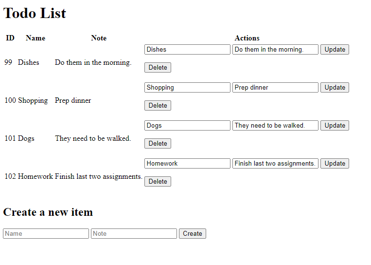

# Flask-PostgreSQL
 
<!-- Improved compatibility of back to top link: See: https://github.com/othneildrew/Best-README-Template/pull/73 -->
<a name="readme-top"></a>
<!--
*** Thanks for checking out the Best-README-Template. If you have a suggestion
*** that would make this better, please fork the repo and create a pull request
*** or simply open an issue with the tag "enhancement".
*** Don't forget to give the project a star!
*** Thanks again! Now go create something AMAZING! :D
-->


<!-- PROJECT SHIELDS -->
<!--
*** I'm using markdown "reference style" links for readability.
*** Reference links are enclosed in brackets [ ] instead of parentheses ( ).
*** See the bottom of this document for the declaration of the reference variables
*** for contributors-url, forks-url, etc. This is an optional, concise syntax you may use.
*** https://www.markdownguide.org/basic-syntax/#reference-style-links
-->
[![Contributors][contributors-shield]][contributors-url]
[![Forks][forks-shield]][forks-url]
[![Stargazers][stars-shield]][stars-url]
[![Issues][issues-shield]][issues-url]
[![MIT License][license-shield]][license-url]
[![LinkedIn][linkedin-shield]][linkedin-url]


<!-- PROJECT LOGO -->
<br />
<div align="center">
  <a href="https://github.com/apruitt13/Flask-PostgreSQL">
    
    
  </a>

<h3 align="center">ToDo with Flask and PostgreSQL</h3>

  <p align="center">
    A small project to explore Flask and PostgreSQL.
    <br />
    <a href="https://github.com/apruitt13/Flask-PostgreSQL"><strong>Explore the docs »</strong></a>
    <br />
    <br />
    <a href="https://github.com/apruitt13/Flask-PostgreSQL">View Demo</a>
    ·
    <a href="https://github.com/apruitt13/Flask-PostgreSQL/issues">Report Bug</a>
    ·
    <a href="https://github.com/apruitt13/Flask-PostgreSQL/issues">Request Feature</a>
  </p>
</div>


<!-- TABLE OF CONTENTS -->
<details>
  <summary>Table of Contents</summary>
  <ol>
    <li>
      <a href="#about-the-project">About The Project</a>
      <ul>
        <li><a href="#built-with">Built With</a></li>
      </ul>
    </li>
    <li>
      <a href="#getting-started">Getting Started</a>
      <ul>
        <li><a href="#prerequisites">Prerequisites</a></li>
        <li><a href="#installation">Installation</a></li>
      </ul>
    </li>
    <li><a href="#usage">Usage</a></li>
    <li><a href="#roadmap">Roadmap</a></li>
    <li><a href="#contributing">Contributing</a></li>
    <li><a href="#license">License</a></li>
    <li><a href="#contact">Contact</a></li>
    <li><a href="#acknowledgments">Acknowledgments</a></li>
  </ol>
</details>


<!-- ABOUT THE PROJECT -->
## About The Project



A small project to begin learning Flask and PostgreSQL. It started out as a simple CRUD application for adding grocery items to a list. I then changed it to a basic ToDo list with CRUD functions.

<p align="right">(<a href="#readme-top">back to top</a>)</p>


### Built With

* [![python][Python]][Python-url]
* [![Flask][Flask]][Flask-url]
* [![PostgreSQL][PostgreSQL]][PostgreSQL-url]

<p align="right">(<a href="#readme-top">back to top</a>)</p>


<!-- GETTING STARTED -->
## Getting Started

To get a local copy up and running follow these simple example steps.

### Prerequisites

Before starting this project make sure to have Flask installed on the computer or in the directory of the project.
* npm
  ```sh
  pip install Flask
  ```

### Installation

1. Clone the repo
   ```sh
   git clone https://github.com/apruitt13/Flask-PostgreSQL.git
   ```
3. Open your command prompt

4. cd into the folder with app.py

5. Use the command python app.py


<p align="right">(<a href="#readme-top">back to top</a>)</p>


<!-- USAGE EXAMPLES -->
## Usage

This is a useful project to begin exploring how to use create a basic app that uses Flask and PostgresSQl with full CRUD operations. This project was based on the tutorial from [GeeksForGeeks](https://www.geeksforgeeks.org/making-a-flask-app-using-a-postgresql-database/)_.

You can also modify and view your tables using the pgAdmin 4 program.


_For more examples, please refer to the [Documentation](https://example.com)_

<p align="right">(<a href="#readme-top">back to top</a>)</p>


<!-- ROADMAP -->
## Roadmap

- [ ] Make it more visually appealing.
- [ ] Show accomplished tasks.
- [ ] Options to share the list with others.

See the [open issues](https://github.com/apruitt13/Flask-PostgreSQL/issues) for a full list of proposed features (and known issues).

<p align="right">(<a href="#readme-top">back to top</a>)</p>


<!-- CONTRIBUTING -->
## Contributing

Contributions are what make the open source community such an amazing place to learn, inspire, and create. Any contributions you make are **greatly appreciated**.

If you have a suggestion that would make this better, please fork the repo and create a pull request. You can also simply open an issue with the tag "enhancement".
Don't forget to give the project a star! Thanks again!

1. Fork the Project
2. Create your Feature Branch (`git checkout -b feature/AmazingFeature`)
3. Commit your Changes (`git commit -m 'Add some AmazingFeature'`)
4. Push to the Branch (`git push origin feature/AmazingFeature`)
5. Open a Pull Request

<p align="right">(<a href="#readme-top">back to top</a>)</p>


<!-- LICENSE -->
## License

Distributed under the MIT License. See `LICENSE.txt` for more information.

<p align="right">(<a href="#readme-top">back to top</a>)</p>


<!-- CONTACT -->
## Contact

Adam Pruitt - apruitt13@gmail.com

Project Link: [https://github.com/apruitt13/Flask-PostgreSQL](https://github.com/apruitt13/Flask-PostgreSQL)

<p align="right">(<a href="#readme-top">back to top</a>)</p>


<!-- ACKNOWLEDGMENTS -->
## Acknowledgments

* https://www.geeksforgeeks.org/making-a-flask-app-using-a-postgresql-database/
* https://www.geeksforgeeks.org/how-to-run-a-flask-application/
* https://access.crunchydata.com/documentation/pgadmin4/4.18/editgrid.html#:~:text=To%20view%20or%20modify%20data,table%20must%20be%20uniquely%20identifiable.

<p align="right">(<a href="#readme-top">back to top</a>)</p>


<!-- MARKDOWN LINKS & IMAGES -->
<!-- https://www.markdownguide.org/basic-syntax/#reference-style-links -->
[contributors-shield]: https://img.shields.io/github/contributors/apruitt13/Flask-PostgreSQL.svg?style=for-the-badge
[contributors-url]: https://github.com/apruitt13/Flask-PostgreSQL/graphs/contributors
[forks-shield]: https://img.shields.io/github/forks/apruitt13/Flask-PostgreSQL.svg?style=for-the-badge
[forks-url]: https://github.com/apruitt13/Flask-PostgreSQL/network/members
[stars-shield]: https://img.shields.io/github/stars/apruitt13/Flask-PostgreSQL.svg?style=for-the-badge
[stars-url]: https://github.com/apruitt13/Flask-PostgreSQL/stargazers
[issues-shield]: https://img.shields.io/github/issues/apruitt13/Flask-PostgreSQL.svg?style=for-the-badge
[issues-url]: https://github.com/apruitt13/Flask-PostgreSQL/issues
[license-shield]: https://img.shields.io/github/license/apruitt13/Flask-PostgreSQL.svg?style=for-the-badge
[license-url]: https://github.com/apruitt13/Flask-PostgreSQL/blob/main/LICENSE
[linkedin-shield]: https://img.shields.io/badge/-LinkedIn-black.svg?style=for-the-badge&logo=linkedin&colorB=555
[linkedin-url]: https://linkedin.com/in/apruitt13
[product-screenshot]: images/project.png
[Python]: https://www.python.org/static/img/python-logo.png
[Python-url]: https://www.python.org/
[Flask]: https://flask.palletsprojects.com/en/3.0.x/_images/flask-horizontal.png
[Flask-url]: https://flask.palletsprojects.com/en/3.0.x/
[PostgreSQL]: https://www.postgresql.org/media/img/about/press/elephant.png
[PostgreSQL-url]: https://www.postgresql.org/
